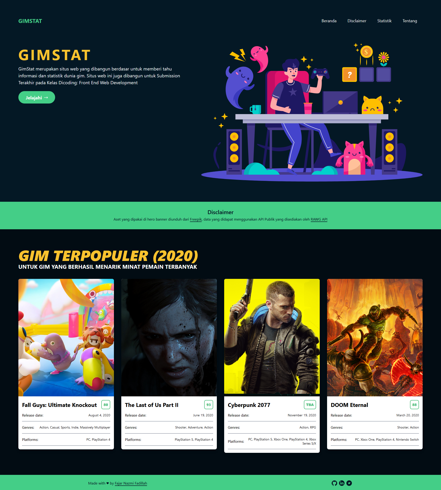

# Project Info

Final submission for [Dicoding's "Belajar Front-End Fundamental" Programming Course](https://www.dicoding.com/academies/163)

## Preview

## Used

- Visual Studio Code (IDE)
- HTML, CSS, Js Vanilla
- [RAWG API](https://api.rawg.io/docs/)
- tailwindcss, webpack
